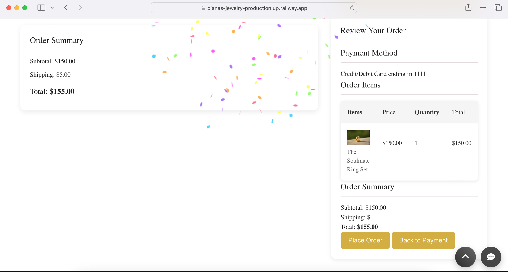
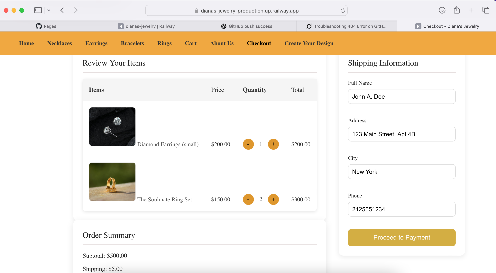

💎 Diana's Jewelry

[![Live Demo]](https://dianas-jewelry-production.up.railway.app/index.html)

🌟 Overview

Diana's Jewelry is a full-stack e-commerce website for jewelry enthusiasts.  
It features product listings, shopping cart, checkout system, and responsive design.  
The site is powered by Node.js, Express, and MySQL, and is deployed live on [Railway](https://dianas-jewelry-production.up.railway.app).

 🛠️ Tech Stack

- Backend: Node.js, Express.js  
- Frontend: HTML, CSS, JavaScript, jQuery  
- Database: MySQL  
- Deployment: Railway (Backend + Frontend)  
- Version Control: Git & GitHub  

 ⚡ Features

- Dynamic product listing from MySQL database  
- Shopping cart functionality  
- Checkout and feedback pages  
- Fully responsive layout for desktop and mobile  
- Static assets served via `public` folder  
- Professional UI with fonts, icons, and images  

🖼️ Screenshots

 🚀 Getting Started

 Prerequisites
- Node.js installed  
- MySQL installed and running  
- Git installed

 Setup
1. Clone the repo:
   bash
   git clone https://github.com/aqsak-dev99/dianas-jewelry.git
   cd dianas-jewelry
   npm  install

➜ Install dependencies:
  
➜ Set up the database
Open MySQL and create a new database, e.g. dianas_jewelry
Import the provided SQL file dianas_jewelry.sql:
SOURCE dianas_jewelry.sql;
➜ Configure environment variables
➜ Create a .env file in the root directory
➜ Add your database and server configuration, e.g.:
DB_HOST=localhost
DB_USER=root
DB_PASSWORD=your_password
DB_NAME=dianas_jewelry
PORT=3000
➜ Start the server
npm start
➜ Open in your browser
Visit http://localhost:3000 to see the website live locally
Optional
➜ To stop the server, press Ctrl + C in the terminal
➜ Make sure MySQL is running whenever you want to use the site
