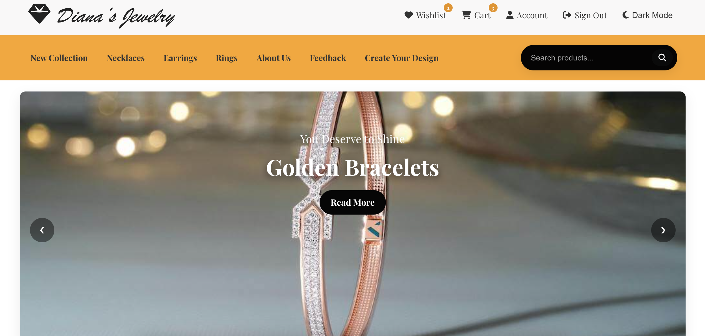

💎 Diana's Jewelry

[![Live Demo]](https://dianas-jewelry-production.up.railway.app/index.html)

🌟 Overview

Diana's Jewelry is a full-stack e-commerce website for jewelry enthusiasts.  
It features product listings, shopping cart, checkout system, and responsive design.  
The site is powered by Node.js, Express, and MySQL, and is deployed live on [Railway](https://dianas-jewelry-production.up.railway.app).

 🛠️ Tech Stack

- Backend: Node.js, Express.js  
- Frontend: HTML, CSS, JavaScript, jQuery  
- Database: MySQL  
- Deployment: Railway (Backend + Frontend)  
- Version Control: Git & GitHub  

 ⚡ Features

- Dynamic product listing from MySQL database  
- Shopping cart functionality  
- Checkout and feedback pages  
- Fully responsive layout for desktop and mobile  
- Static assets served via `public` folder  
- Professional UI with fonts, icons, and images  

🖼️ Screenshots
  
  
  
  

 🚀 Getting Started

 Prerequisites
- Node.js installed  
- MySQL installed and running  
- Git installed

 Setup
1. Clone the repo:
   bash
   git clone https://github.com/aqsak-dev99/dianas-jewelry.git
   cd dianas-jewelry
